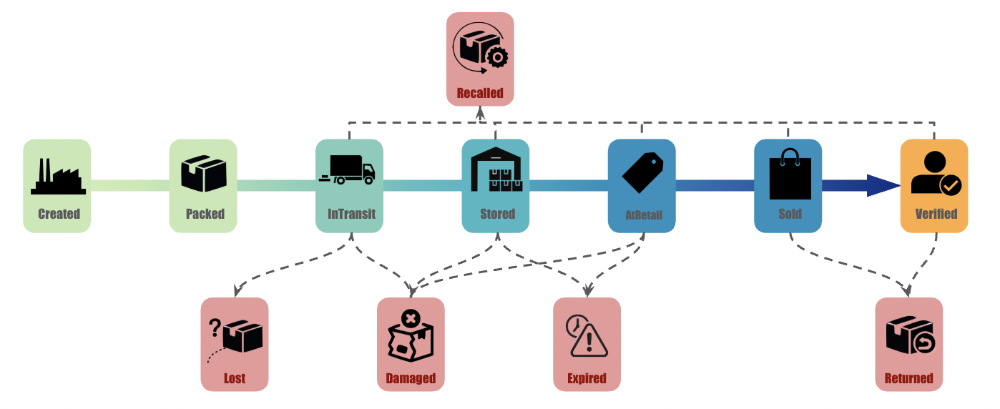
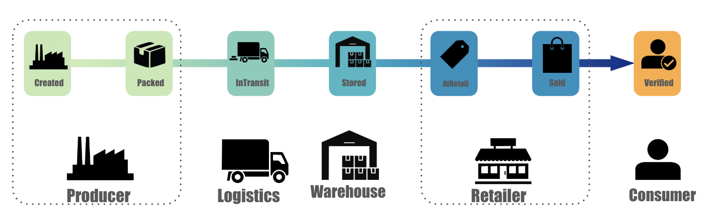

# Blockchain-Based Supply Chain Provenance System

CSE 540 – Group 17  
Alvin Ton · Evan Zhu · Jiayang Xiao · Takeyuki Oshima · Yijin Yang

---

## Description

A Solidity smart contract deployed on Ethereum that records an immutable, append-only provenance history for products as they move through a multi-party supply chain. Stakeholders include producers, logistics providers, warehouses, retailers, consumers, and regulators/admin roles. Each holds a role that governs which contract functions it may call. All key lifecycle events are stored on-chain with actor address, timestamp, and `eventMetadata` (for example an IPFS CID).

**Problem addressed:** Fragmented, mutable, and non-interoperable tracking systems across supply chain participants. This system replaces centralized trust with a shared, verifiable on-chain record.

---

## Repository Structure

```
/
├── contracts/
│   ├── ISupplyChainProvenance.sol   # Interface: enums, structs, events, function signatures
│   └── SupplyChainProvenance.sol    # Core smart contract implementation
├── scripts/
│   ├── cli.js                       # Interactive multi-role CLI on a local Hardhat network
│   ├── demo.js                      # Single-product end-to-end lifecycle demo
│   ├── demo2.js                     # Extended demo with validation checks and visualization output
│   └── demo2-visualization.md       # Generated Mermaid sequence diagram from demo2
├── test/
│   └── test.js                      # Hardhat unit tests
├── web/
│   ├── index.html                   # Minimal browser UI
│   ├── app.js
│   └── styles.css
├── README.md
└── package.json
```

---

## Requirements

| Tool    | Version    | Notes                                          |
|---------|------------|------------------------------------------------|
| Node.js | 22.x (LTS) | Required — Hardhat 2 does not support Node 20  |
| npm     | >= 10.x    | Comes bundled with Node.js                     |
| nvm     | any        | Recommended for managing Node versions         |

---

## Setup & Installation

### Step 1 — Install nvm (if not already installed)

```bash
curl -o- https://raw.githubusercontent.com/nvm-sh/nvm/v0.39.7/install.sh | bash
source ~/.bashrc
```

### Step 2 — Install Node.js 22

```bash
nvm install 22
nvm use 22
node --version   # should show v22.x.x
```

### Step 3 — Clone the repository

```bash
git clone https://github.com/breadyaboi/CSE540-Blockchain-Group-17-Project.git
cd CSE540-Blockchain-Group-17-Project
git checkout yijin/main
```

### Step 4 — Install dependencies

```bash
npm install
```

### Step 5 — Compile the contracts

```bash
npx hardhat compile
```

Expected output: `Compiled 2 Solidity files successfully`

### Step 6 — Run tests

```bash
npx hardhat test
```

Expected output: `13 passing`

---

## Smart Contract Overview

### Lifecycle

```
Created → Packed → InTransit → Stored → AtRetail → Sold → Verified
```



Exception states:

```
Recalled, Returned, Damaged, Expired, Lost
```

### Roles

| Role        | Permissions |
|-------------|-------------|
| Owner/Admin | Assign roles to stakeholders |
| SystemAdmin | Assign roles to stakeholders |
| Producer    | Register products and update `Created -> Packed` |
| Logistics   | Update `Packed -> InTransit`; may mark `Damaged` or `Lost` while in transit |
| Warehouse   | Update `InTransit -> Stored`; may mark `Damaged` or `Expired` |
| Retailer    | Update `Stored -> AtRetail -> Sold`; may mark `Returned`, `Damaged`, or `Expired` where valid |
| Consumer    | Verify a sold product after custody is transferred to the consumer |
| Regulator   | Set `Recalled` without custody |
| Auditor     | Read-only audit access |

### Key Functions

| Function | Caller | Description |
|----------|--------|-------------|
| `assignRole(address, Role)` | Owner or `SystemAdmin` | Assign a role to a stakeholder |
| `registerProduct(productId, metadataHash)` | Producer | Create initial on-chain product record |
| `transferCustody(productId, newCustodian, eventMetadata)` | Current custodian | Hand off custody to the next valid participant in the lifecycle |
| `updateStatus(productId, newStatus, eventMetadata)` | Current custodian | Advance product lifecycle state when the caller's role is authorized for that status |
| `verifyProduct(productId, eventMetadata)` | Consumer | Mark product as verified after sale and transfer to the consumer |
| `getProduct(productId)` | Anyone | Return current product record |
| `getProvenanceHistory(productId)` | Anyone | Return full event history array |
| `getRole(address)` | Anyone | Return role assigned to an address |



---

## Team Role Mapping

| Member          | Contract Responsibility                                                       |
|-----------------|-------------------------------------------------------------------------------|
| Evan Zhu        | Core transaction logic (`registerProduct`, `transferCustody`, `updateStatus`) |
| Jiayang Xiao    | Data structures (`Product`, `ProvenanceRecord` structs, lifecycle model)      |
| Takeyuki Oshima | Transaction flow and state transition validation (`_isValidTransition`)       |
| Yijin Yang      | RBAC design (role modifiers, `assignRole`)                                    |
| Alvin Ton       | Stakeholder interface design (`verifyProduct`, UI interaction spec)           |

---

## Status

Run tests:
```bash
npm test
```

Run demo:
```
npm run demo
```

Run advanced demo:
```bash
npm run demo:advanced
```

Run Interactive CLI:
```
npm run cli
```

Run Web UI:
```
npm run web
# open http://localhost:4173/web/index.html
```

CLI capabilities:
- Switch between `owner`, `producer`, `logistics`, `warehouse`, `retailer`, `consumer`, `regulator`, and `viewer`
- Manually register products, transfer custody, update status, verify products, and query history
- Run a full multi-role lifecycle demo from the menu

## Workflow Rules

### Role-scoped status transitions

- `Producer`: `Created -> Packed`
- `Logistics`: `Packed -> InTransit`
- `Warehouse`: `InTransit -> Stored`
- `Retailer`: `Stored -> AtRetail -> Sold`
- `Consumer`: `Sold -> Verified`
- Exception states supported: `Returned`, `Recalled`, `Damaged`, `Expired`, `Lost`

### Custody transfer rules

- `Producer -> Logistics` only when status is `Packed`
- `Logistics -> Warehouse` only when status is `InTransit`
- `Warehouse -> Retailer` only when status is `Stored`
- `Retailer -> Consumer` only when status is `Sold`

### Full happy path

1. `Producer` registers product as `Created`
2. `Producer` updates to `Packed`
3. custody transfers to `Logistics`
4. `Logistics` updates to `InTransit`
5. custody transfers to `Warehouse`
6. `Warehouse` updates to `Stored`
7. custody transfers to `Retailer`
8. `Retailer` updates to `AtRetail`
9. `Retailer` updates to `Sold`
10. custody transfers to `Consumer`
11. `Consumer` verifies the product

These rules intentionally reject invalid flows such as a producer transferring directly to a retailer or regulator, or a participant updating statuses outside its stage of the supply chain.
