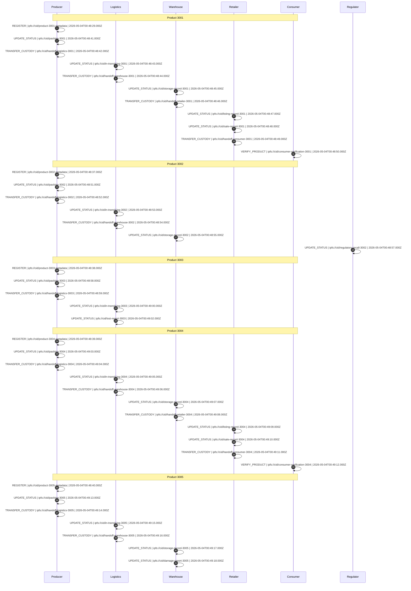

# Demo 2 Visualization

Generated from on-chain provenance history in `scripts/demo2.js`.

```mermaid
sequenceDiagram
  autonumber
  participant P as Producer
  participant L as Logistics
  participant W as Warehouse
  participant R as Retailer
  participant C as Consumer
  participant G as Regulator
  Note over P,C: Product 3001
  P->>P: REGISTER | ipfs://cid/product-3001-metadata | 2026-05-04T00:48:29.000Z
  P->>P: UPDATE_STATUS | ipfs://cid/packing-3001 | 2026-05-04T00:48:41.000Z
  P->>P: TRANSFER_CUSTODY | ipfs://cid/handoff-logistics-3001 | 2026-05-04T00:48:42.000Z
  L->>L: UPDATE_STATUS | ipfs://cid/in-transit-log-3001 | 2026-05-04T00:48:43.000Z
  L->>L: TRANSFER_CUSTODY | ipfs://cid/handoff-warehouse-3001 | 2026-05-04T00:48:44.000Z
  W->>W: UPDATE_STATUS | ipfs://cid/storage-record-3001 | 2026-05-04T00:48:45.000Z
  W->>W: TRANSFER_CUSTODY | ipfs://cid/handoff-retailer-3001 | 2026-05-04T00:48:46.000Z
  R->>R: UPDATE_STATUS | ipfs://cid/listing-record-3001 | 2026-05-04T00:48:47.000Z
  R->>R: UPDATE_STATUS | ipfs://cid/sale-record-3001 | 2026-05-04T00:48:48.000Z
  R->>R: TRANSFER_CUSTODY | ipfs://cid/handoff-consumer-3001 | 2026-05-04T00:48:49.000Z
  C->>C: VERIFY_PRODUCT | ipfs://cid/consumer-verification-3001 | 2026-05-04T00:48:50.000Z
  Note over P,C: Product 3002
  P->>P: REGISTER | ipfs://cid/product-3002-metadata | 2026-05-04T00:48:37.000Z
  P->>P: UPDATE_STATUS | ipfs://cid/packing-3002 | 2026-05-04T00:48:51.000Z
  P->>P: TRANSFER_CUSTODY | ipfs://cid/handoff-logistics-3002 | 2026-05-04T00:48:52.000Z
  L->>L: UPDATE_STATUS | ipfs://cid/in-transit-log-3002 | 2026-05-04T00:48:53.000Z
  L->>L: TRANSFER_CUSTODY | ipfs://cid/handoff-warehouse-3002 | 2026-05-04T00:48:54.000Z
  W->>W: UPDATE_STATUS | ipfs://cid/storage-record-3002 | 2026-05-04T00:48:55.000Z
  G->>G: UPDATE_STATUS | ipfs://cid/regulatory-recall-3002 | 2026-05-04T00:48:57.000Z
  Note over P,C: Product 3003
  P->>P: REGISTER | ipfs://cid/product-3003-metadata | 2026-05-04T00:48:38.000Z
  P->>P: UPDATE_STATUS | ipfs://cid/packing-3003 | 2026-05-04T00:48:58.000Z
  P->>P: TRANSFER_CUSTODY | ipfs://cid/handoff-logistics-3003 | 2026-05-04T00:48:59.000Z
  L->>L: UPDATE_STATUS | ipfs://cid/in-transit-log-3003 | 2026-05-04T00:49:00.000Z
  L->>L: UPDATE_STATUS | ipfs://cid/lost-report-3003 | 2026-05-04T00:49:02.000Z
  Note over P,C: Product 3004
  P->>P: REGISTER | ipfs://cid/product-3004-metadata | 2026-05-04T00:48:39.000Z
  P->>P: UPDATE_STATUS | ipfs://cid/packing-3004 | 2026-05-04T00:49:03.000Z
  P->>P: TRANSFER_CUSTODY | ipfs://cid/handoff-logistics-3004 | 2026-05-04T00:49:04.000Z
  L->>L: UPDATE_STATUS | ipfs://cid/in-transit-log-3004 | 2026-05-04T00:49:05.000Z
  L->>L: TRANSFER_CUSTODY | ipfs://cid/handoff-warehouse-3004 | 2026-05-04T00:49:06.000Z
  W->>W: UPDATE_STATUS | ipfs://cid/storage-record-3004 | 2026-05-04T00:49:07.000Z
  W->>W: TRANSFER_CUSTODY | ipfs://cid/handoff-retailer-3004 | 2026-05-04T00:49:08.000Z
  R->>R: UPDATE_STATUS | ipfs://cid/listing-record-3004 | 2026-05-04T00:49:09.000Z
  R->>R: UPDATE_STATUS | ipfs://cid/sale-record-3004 | 2026-05-04T00:49:10.000Z
  R->>R: TRANSFER_CUSTODY | ipfs://cid/handoff-consumer-3004 | 2026-05-04T00:49:11.000Z
  C->>C: VERIFY_PRODUCT | ipfs://cid/consumer-verification-3004 | 2026-05-04T00:49:12.000Z
  Note over P,C: Product 3005
  P->>P: REGISTER | ipfs://cid/product-3005-metadata | 2026-05-04T00:48:40.000Z
  P->>P: UPDATE_STATUS | ipfs://cid/packing-3005 | 2026-05-04T00:49:13.000Z
  P->>P: TRANSFER_CUSTODY | ipfs://cid/handoff-logistics-3005 | 2026-05-04T00:49:14.000Z
  L->>L: UPDATE_STATUS | ipfs://cid/in-transit-log-3005 | 2026-05-04T00:49:15.000Z
  L->>L: TRANSFER_CUSTODY | ipfs://cid/handoff-warehouse-3005 | 2026-05-04T00:49:16.000Z
  W->>W: UPDATE_STATUS | ipfs://cid/storage-record-3005 | 2026-05-04T00:49:17.000Z
  W->>W: UPDATE_STATUS | ipfs://cid/damage-report-3005 | 2026-05-04T00:49:18.000Z
```
